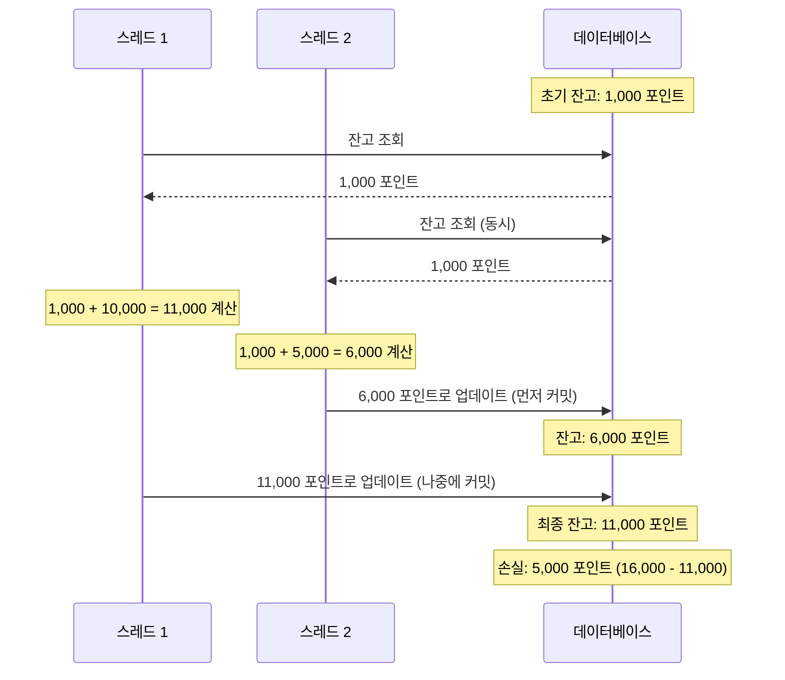

# 동시성 제어 방식에 대한 분석 및 보고서

# 목차

[1. 문제 상황](#1-문제-상황)

[2. 해결 방안](#2-해결-방안)

[3. Synchronized](#3-Synchronized)

[4. ReentrantLock](#4-ReentrantLock)

[5. ConcurrentHashMap](#5-ConcurrentHashMap)

[6. 결론](#6-결론)

---

# 1. 문제 상황

## 시나리오

- **A 사용자 초기 잔고**: 1,000 포인트

- **스레드 1**: A 사용자가 10,000 포인트 충전 요청

- **스레드 2**: A 사용자가 동시에 5,000 포인트 충전 요청

## 문제 발생 과정

1. **스레드 1**이 A 사용자 잔고 1,000 포인트를 조회

2. **스레드 2**가 동시에 A 사용자 잔고 1,000 포인트를 조회 (같은 값)

3. 스레드 1이 10,000 포인트를 충전하여 11,000 포인트로 계산

4. 스레드 2가 5,000 포인트를 충전하여 6,000 포인트로 계산

5. **스레드 2가 먼저 커밋**하여 DB에 6,000 포인트 저장

6. **스레드 1이 나중에 커밋**하여 DB에 11,000 포인트로 덮어씀

## 결과

- **기대값**: 1,000 + 10,000 + 5,000 = 16,000 포인트

- **실제값**: 11,000 포인트 (5,000 포인트 손실)

---

# 2. 해결 방안

포인트 충전 시 발생하는 동시성 문제를 해결하기 위해 다음과 같은 세 가지 방안을 검토하였습니다.

1. **Synchronized**를 활용해 임계 영역에 동시에 하나의 스레드만 접근하도록 제어합니다.

2. **ReentrantLock**을 사용하여 요청이 들어온 순서대로 처리함으로써 순서를 보장합니다.

3. **ConcurrentHashMap**을 활용해 사용자별 요청 처리를 안전하게 보장합니다.

---

# 3. Synchronized

## 개선 사항

**모니터 락(Monitor Lock)** 을 활용하여 임계 영역을 보호함으로써 **코드 블록에 하나의 스레드만 접근**할 수 있도록 동시성 문제를 해결합니다.

## 동기화 유형

### 메서드 레벨 동기화

- **인스턴스 메서드 동기화**: `synchronized method`

- **정적 메서드 동기화**: `static synchronized method`

### 블록 레벨 동기화

- **인스턴스 블록 동기화**: `synchronized block`

- **정적 블록 동기화**: `static synchronized block`

## 주요 특성

### **재진입성 (Reentrant)**

- 락의 획득이 **스레드 단위**로 일어남

- 이미 락을 획득한 스레드는 **같은 락을 다시 획득할 때 대기하지 않음**

- 따라서 중첩된 synchronized 블록 진입 시 동일한 락을 즉시 확보

### **가시성 (Visibility)**

- 한 스레드가 공유 자원을 수정했을 때 **다른 스레드에서 수정 내용이 즉시 보임**

- 메모리 가시성 문제 해결

## 장점

- **자동 잠금 해제**: synchronized 메서드나 블록 완료 시 자동으로 락 해제

- **간편한 사용**: 별도의 락 관리 코드 불필요

## 단점

### **제어 기능 부족**

- **인터럽트 불가**: 블록 내에서 스레드 인터럽트 설정 불가능

- **타임아웃 불가**: 무한 대기 상태에 빠질 위험

## 한계

### **공정성 문제**

- 락 획득 순서 보장하지 않음

- 여러 대기 스레드 중 어떤 스레드가 락을 획득할지 예측 불가

- **기아 현상(Starvation)** 발생 가능성

### **성능 제약**

- 모든 사용자 요청이 하나의 락으로 관리되어 **병목 현상 발생**

---

# 4. ReentrantLock

## 개선 사항

**명시적 락**을 활용해 임계 영역을 보호함으로써 **세밀한 락 제어**가 가능하며, **공정성 설정**을 통해 요청 순서를 보장합니다.

## 주요 특성

`synchronized`와 동일한 **상호배제(Mutual Exclusion)** 기능 제공과 가시성 보장

### **확장된 기능**

| **기능**                    | **설명**                                 |
| ------------------------- | -------------------------------------- |
| `lockInterruptibly()`     | 락 획득 중 **인터럽트 가능**                     |
| `tryLock(long, TimeUnit)` | **타임아웃 설정**으로 무한 대기 방지                 |
| `isFair()`                | **공정성 모드** 확인 (true: FIFO, false: 불공정) |

### **명시적 제어**

- `lock()`으로 락 획득

- `unlock()`으로 **반드시 명시적 해제 필요** (finally 블록에서 처리 권장)

## 단점

### **공정 모드의 성능 비용**

- **큐 관리 오버헤드**: FIFO 유지를 위한 추가 연산

- **캐시 지역성 저하**: 스레드가 다른 CPU 코어에서 활성화될 때 발생

## 한계

여전히 사용자별로 독립적인 작업 처리가 보장되지 않아, 모든 사용자가 같은 락을 공유함으로써 병목 현상이 발생할 수 있습니다.

## 키워드

- **ReentrantReadWriteLock**: 읽기/쓰기 락 분리로 성능 향상

---

# 5. ConcurrentHashMap

## 개선 사항

**세그먼트 기반 잠금(Segmented Locking)** 을 활용해 사용자별 독립적 락 관리를 구현함으로써 **사용자 단위로 작업을 격리**하고, **사용자 내 순차적 처리**를 보장합니다.

## 주요 특성

## 동기화 메커니즘

- 내부를 **독립적인 세그먼트로 분할**

- 서로 다른 스레드가 서로 다른 세그먼트에 **동시 접근 가능**

- 전체 락 대비 **락 경쟁 감소**

## **병렬 처리 최적화**

| **작업 유형** | **동작 방식**  |
| --------- | ---------- |
| **읽기**    | 락 없이 수행    |
| **쓰기**    | 세그먼트 단위 잠금 |
| **수정**    | CAS 연산 사용  |

---

# 6. 결론

ConcurrentHashMap과 ReentrantLock을 활용해 사용자별 작업을 독립적으로 처리하고 순차적 실행을 보장하는 동시성 제어를 구현했습니다. 하지만 현재의 구현 방식은 단일 서버 환경에서는 문제가 없지만, 멀티 서버 환경에서는 프로세스 간 락 공유가 불가능해 동시성 문제를 해결할 수 없습니다. 이처럼 멀티 서버 환경에서의 동시성 문제를 해결하기 위해서는 Redis를 통해 단일 중앙 서버에 락 관리를 위임하여 N개 서버의 동시성을 제어할 수 있습니다.